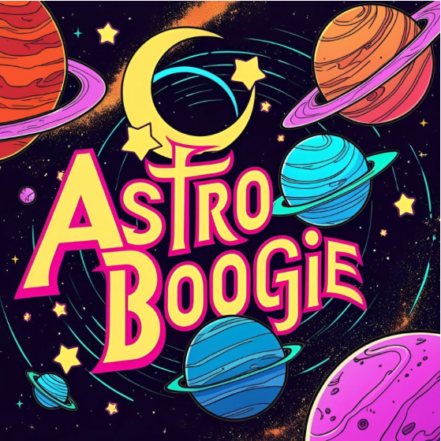

# Astro Boogie Animation

This project is a playful SVG animation called Astro Boogie, featuring a cosmic dance of blinking stars and spinning orbits. The animation was created as part of an assignment in the course <em>Grafiska verktyg</em> at Medieinstitutet where we got to work with and experiment with SVG files and animations.

## Project Overview

The goal of this assignment was to:

- Create an SVG file using a design tool such as Illustrator, Inkscape, or Figma.
- Include non-standard fonts (not Arial, Helvetica, or Times New Roman), and convert the text into outlines to ensure consistent appearance across systems.
- Animate the SVG with features like rotation, color changes, or other creative effects.

Features of the Astro Boogie Animation:
- Stars scattered across the canvas blink by transitioning their opacity over time
- Spinning orbits changing colours with a yoyo effect, meaning that they are constantly transitioning between colours. 
- Sunbeams spinning around the center ang changing size 
- The word **Astro** scaling down, making it apear smaller and the word **Boogie** scaling up, making it appear lager. 

## Tools Used

Design: The entire deign of the Astro Boogie scene was created as an SVG file in Adobe Illustrotor 

Animation: GSAP is used to handle all animations snd some basic CSS is used for layout and styling.

> ### Go out and enjoy som **Astro Boogie** time! 
>[Link to live page](https://medieinstitutet.github.io/fed24d-grafiska-verktyg-individuell-AgnesWilson/)

# AI-generated image
I wanted to keep working on the **Astro Boogie** theme so i took to AI to generate an image suitable for some Astro boogie. My goal was to create a retro-inspired album cover that reflects the playful, cosmic energy of the project. The image embodies a 70s boogie feel with a touch of funky, intergalactic style, as if it were a vintage vinyl record cover ready for a cosmic dance party.

This is the prompt i used:
>"Design a retro-style album cover inspired by 70s and 80s space-themed aesthetics. The artwork should feature vibrant, neon colors, swirling planets, glowing stars, and cosmic dust. Include a bold, funky font for the album title 'Astro Boogie,' with a subtle glow around the letters, giving them a lively, pulsing effect.

